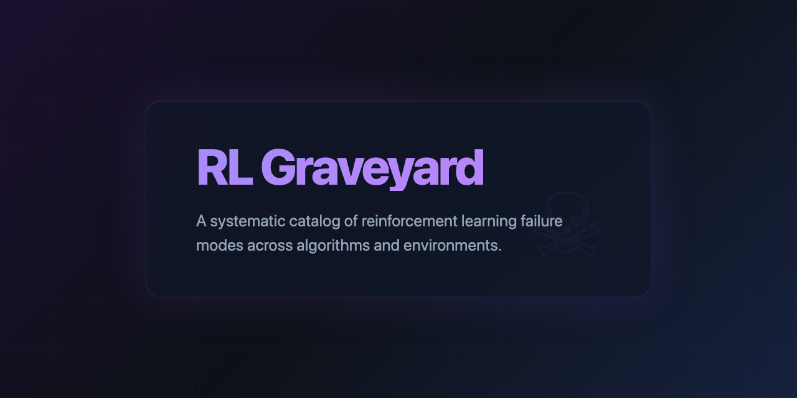

<p align="center">
  
</p>

# RL Graveyard: A Systematic Catalog of Reinforcement Learning Failure Modes

An empirical study of where and how reinforcement learning algorithms fail across diverse environments.

## Motivation

The reinforcement learning literature overwhelmingly reports success curves and convergence plots. The failures, which constitute the majority of training runs in practice, are rarely documented or analyzed. This project attempts to correct that imbalance by training hundreds of RL agents, classifying their exact failure modes, and visualizing the results.

## Research Question

Which RL algorithms fail on which environments, and why? Can we predict failure from training dynamics?

## Failure Taxonomy

| Code | Name | Description |
|------|------|-------------|
| RH | Reward Hacking | Agent finds unintended shortcut to high reward |
| CF | Catastrophic Forgetting | Agent forgets earlier skills |
| EC | Exploration Collapse | Policy collapses to single action, entropy flatlines |
| DS | Death Spiral | Loss diverges, returns crash |
| NE | NaN Explosion | Gradients or losses become NaN |
| SI | Simulation Overfitting | Works in training distribution, fails on slight perturbation |
| ST | Stalling | Plateaus indefinitely at suboptimal performance |
| OS | Overshooting | Oscillates around optimal, never converges |

## Methodology

For each algorithm-environment pair, we run 5 seeds for 1M steps, logging:
- Episode returns
- Policy entropy
- Value function estimates
- Gradient norms
- Action distributions
- Environment-specific success metrics

Failure classification uses a rule-based diagnostic applied to the training trajectory post-hoc.

## Architecture

```
rl-graveyard/
├── agents/              # Algorithm implementations (PPO, SAC, TD3, A2C, DQN)
├── envs/                # Environment wrappers and failure detectors
├── graveyard/           # Interactive visualization layer
├── experiments/         # Training configurations
├── analysis/            # Failure classification pipeline
└── data/                # SQLite database of all training runs
```

## Current Status

Proof of concept: single PPO agent trained on CartPole-v1 exhibits exploration collapse within 50,000 steps. The diagnostic classifier correctly identifies the failure mode from entropy trajectory.

## Dependencies

```
torch>=2.0.0
gymnasium>=0.29.0
numpy>=1.24.0
```

## Running

```bash
python graveyard.py
```

## Citation

If you use this work, please cite:
```
@software{rl_graveyard_2026,
  author = {Vardhan, Manas},
  title = {RL Graveyard: A Systematic Catalog of RL Failure Modes},
  year = {2026},
  url = {https://github.com/ManasVardhan/rl-graveyard}
}
```

## License

MIT
